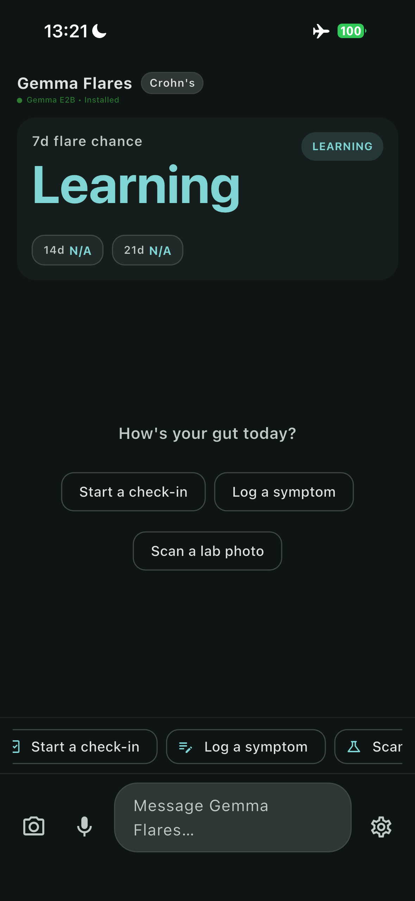
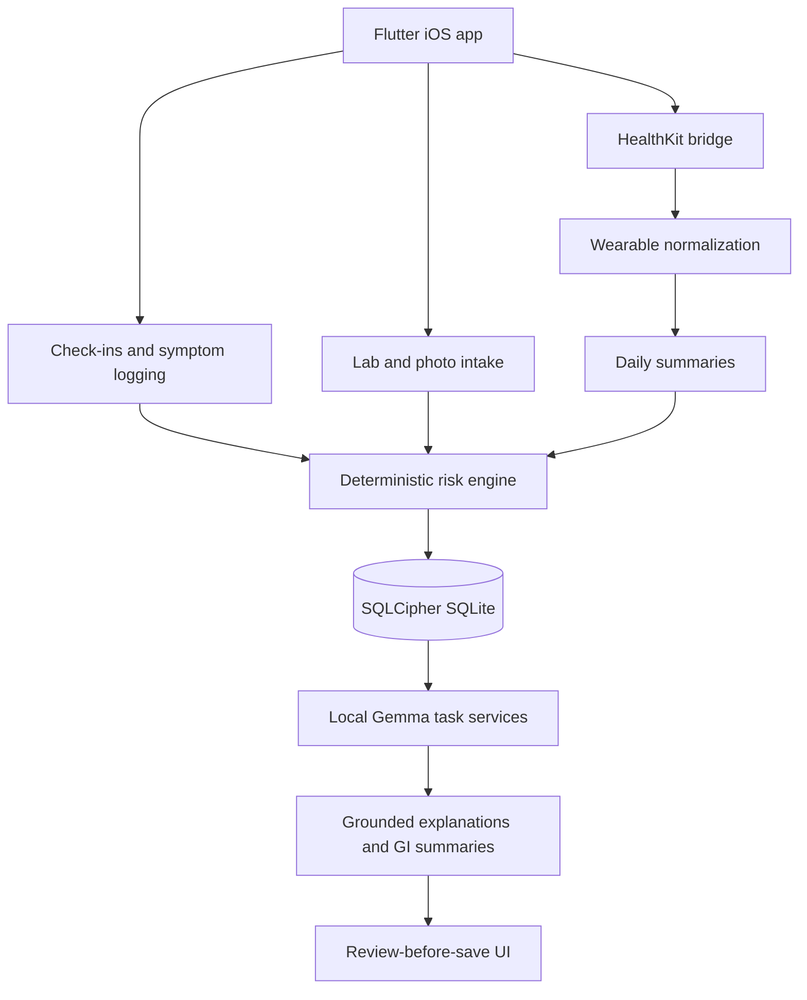

<h1 align="center">Gemma Flares</h1>

<p align="center">
Track IBD patterns on iPhone with deterministic scoring and grounded Gemma summaries.
</p>

<p align="center">
    <a href="#quickstart">Quickstart</a> ·
    <a href="./docs/README.md">Docs</a> ·
    <a href="#development">Development</a> ·
    <a href="#testing">Testing</a>
</p>

Gemma Flares is a local-first Flutter iOS app for people tracking inflammatory
bowel disease patterns and preparing for GI visits. It combines Apple Health
context, symptom and lab logging, deterministic 7-day, 14-day, and 21-day risk
pattern scores, and Gemma-assisted explanations that are grounded in local app
evidence.

Gemma Flares is not a diagnostic system, does not recommend medication changes,
and does not let Gemma compute the risk score. Deterministic app code owns risk
math, persistence, routing, validation, and save/delete truth.

## Demo

<p align="center">
    
</p>

The first useful developer loop is a local Flutter run with optional setup reset:

```bash
flutter pub get
flutter run --dart-define=GEMMA_FLARES_DEV_RESET=true
```

For physical iPhone profile runs, the repo includes a helper that keeps the
default bundle model-free and lets first-run setup handle model installation:

```bash
scripts/ios/run_ios_profile.sh --fast-ui --reset-setup -d <device-id>
```

## Key features

- Computes deterministic 7-day, 14-day, and 21-day flare-risk pattern scores.
- Separates scoring from Gemma so model output explains grounded evidence rather
    than deciding risk.
- Ingests Apple Health and Apple Watch context through the native iOS bridge
    after explicit user permission.
- Logs disease-aware check-ins for Crohn's disease, ulcerative colitis,
    indeterminate colitis, and IBS-style tracking.
- Reviews symptom, lab, and extracted lab-report data before saving records.
- Generates doctor-ready GI summaries with PDF and share flows.
- Supports local export, memory controls, diagnostics, and local wipe behavior.
- Verifies iOS model-bundling modes for no-model public releases and seeded E2B
    internal builds.

## Architecture



Flutter owns the product workflow while native iOS bridges handle HealthKit and
text-recognition integration. The risk engine persists auditable inputs and
contribution breakdowns before Gemma services produce grounded explanations,
extraction drafts, and summary text.

## Requirements

| Requirement | Version or note |
| --- | --- |
| Flutter | Stable channel with Dart SDK compatible with `^3.4.0` |
| Xcode | Required for iOS builds and simulator/device runs |
| macOS | Required for the iOS development workflow |
| iPhone or iOS simulator | Required to run the app surface |
| `hf` CLI | Required only for `scripts/install_litert_lm_models.sh e2b` |
| `shasum` | Required by model artifact verification scripts |

The app uses Flutter packages for SQLCipher-backed local storage, local auth,
notifications, image picking/cropping, PDF generation, sharing, speech input,
and LiteRT-LM integration. See [pubspec.yaml](pubspec.yaml) for the exact
dependency set.

## Installation

Gemma Flares is not published to a package registry. From a checked-out copy of
this repository, install Flutter dependencies:

```bash
flutter pub get
```

Optional local seeded model setup downloads and verifies the approved LiteRT-LM
Gemma 4 E2B artifact:

```bash
scripts/install_litert_lm_models.sh e2b
```

## Quickstart

Run the app locally with a clean setup wizard state:

```bash
flutter pub get
flutter run --dart-define=GEMMA_FLARES_DEV_RESET=true
```

Run the fast local validation loop:

```bash
flutter analyze --no-pub
flutter test --exclude-tags=slow
```

Expected result: Flutter prints analyzer and test results for the current
checkout.

## Configuration

| Name | Required | Default | Description |
| --- | --- | --- | --- |
| `GEMMA_FLARES_DEVICE_AGENT` | No | `false` | Dart define that launches the device-agent UI instead of the main app. |
| `GEMMA_FLARES_DEV_RESET` | No | `false` | Dart define that clears setup state and profile before launch in non-release builds. |
| `GEMMA_EVAL_LIMIT` | No | `16` | Limits scenarios in `test/gemma_eval/local_agent_eval_runner_test.dart`. |
| `GEMMA_EVAL_OUTPUT` | No | `tooling/gemma_eval/out/local_agent_results.jsonl` | Output path for Gemma eval test results. |
| `GEMMA_EVAL_SCENARIOS` | No | `tooling/gemma_eval/out/scenarios.jsonl` | Scenario JSONL path for Gemma eval tests. |
| `GEMMA_EVAL_TIMEOUT_MINUTES` | No | `20` | Timeout budget for the local agent eval runner. |
| `GOLD_RAP_LOCAL_DEV` | No | `1` outside CI, `0` in CI | Selects faster local Gold RAP behavior. |
| `GOLD_RAP_SCHEMA_SAFETY_ONLY` | No | `0` | Runs only schema and safety checks in Gold RAP. |
| `GOLD_RAP_SKIP_GEMMA_EVAL` | No | follows `GOLD_RAP_LOCAL_DEV` | Controls the disabled Gemma eval block in Gold RAP. |
| `GOLD_RAP_SKIP_TESTS` | No | `0` | Skips Gold RAP test execution when set to `1`. |
| `GOLD_RAP_SKIP_UI_WIDGET` | No | follows `GOLD_RAP_LOCAL_DEV` | Skips app/features/widget test targets in Gold RAP. |
| `GOLD_RAP_TEST_EXCLUDE_TAGS` | No | `extended,slow` in local dev | Comma-separated tags excluded from Gold RAP tests. |
| `LITERT_LM_E2B_SHA` | No | approved SHA-256 | Overrides the expected E2B model checksum for model install workflows. |
| `LITERT_LM_MODEL_DOWNLOADS_DIR` | No | `/private/tmp/litert-lm-model-downloads` | Staging directory for model downloads. |

Example local development run:

```bash
flutter run --dart-define=GEMMA_FLARES_DEV_RESET=true
```

## Usage examples

Reset setup state and run the standard app:

```bash
flutter run --dart-define=GEMMA_FLARES_DEV_RESET=true
```

Launch the device-agent app surface:

```bash
flutter run --dart-define=GEMMA_FLARES_DEVICE_AGENT=true
```

Build a no-model iOS release artifact and verify that no model is bundled:

```bash
flutter build ios --release --no-codesign
scripts/validation/verify_ios_release_artifact.sh build/ios/iphoneos/Runner.app --mode=no-model
```

## Project structure

```text
.
├── assets/              Clinical catalogs, i18n resources, and risk model config
├── db/migrations/       Ordered SQLite migration files
├── docs/                Public product-truth and engineering evidence docs
├── integration_test/    Device and adversarial integration tests
├── ios/                 Native iOS project, HealthKit/OCR bridges, model folder
├── lib/                 Flutter app, feature screens, services, and database code
├── scripts/             Validation, iOS profile, and model artifact automation
├── test/                Unit, widget, integration, autonomous, and eval tests
└── tooling/             Gemma eval and QA evidence pipeline tools
```

## Development

Bootstrap the repository:

```bash
flutter pub get
```

Run the app:

```bash
flutter run
```

Run a clean setup pass:

```bash
flutter run --dart-define=GEMMA_FLARES_DEV_RESET=true
```

Run the repo quality gate used for local development:

```bash
GOLD_RAP_LOCAL_DEV=1 bash scripts/validation/validate_gold_rap.sh
```

Format and analyze before sending changes:

```bash
dart format --set-exit-if-changed lib test
flutter analyze --no-pub
```

## Testing

Gemma Flares uses `flutter_test`, `integration_test`, `mockito`, and
`sqflite_common_ffi`. Tests are organized by product surface and risk area:

| Path | Purpose |
| --- | --- |
| `test/core/` | Services, database-facing logic, risk scoring, RAG, safety, and runtime contracts |
| `test/features/` | Feature-screen and flow tests |
| `test/app/` | App shell and readiness tests |
| `test/autonomous/` | Autonomous UI and capability flows |
| `test/gemma_eval/` | Local agent and persona evaluation tests |
| `integration_test/` | Device smoke and adversarial prompt-injection integration tests |

Common commands:

```bash
flutter test --exclude-tags=slow
flutter test test/core/services/risk_engine_service_test.dart
flutter test test/features/home_screen_checkin_flow_test.dart
bash scripts/validation/validate_gold_rap.sh
```

The test tag configuration documents the expected local and full-suite shape in
[dart_test.yaml](dart_test.yaml).

## Deployment

Build an unsigned iOS release bundle:

```bash
flutter build ios --release --no-codesign
```

Verify the public no-model release mode:

```bash
scripts/validation/verify_ios_release_artifact.sh build/ios/iphoneos/Runner.app --mode=no-model
```

Physical iPhone validation, signing, TestFlight upload, and App Store Connect
processing require infrastructure outside this repository.

## Security

Gemma Flares handles health-adjacent data, so changes should preserve the
local-first boundary, explicit HealthKit permission flow, review-before-save
behavior, and local export/wipe controls. Do not commit model binaries,
generated private data, signing material, real patient data, or secrets.

No `SECURITY.md` is present in this repository. Use GitHub private vulnerability
reporting if it is enabled for the project; otherwise contact the maintainer
through the repository before disclosing sensitive issues publicly.

## Troubleshooting

| Problem | What to try |
| --- | --- |
| Setup wizard does not reappear during development | Run with `--dart-define=GEMMA_FLARES_DEV_RESET=true`; the reset is ignored in release builds. |
| Profile iPhone runs fail while staging large app bundles | Use `scripts/ios/run_ios_profile.sh --fast-ui -d <device-id>` to keep the bundle model-free. |
| Model install fails with `Missing required command: hf` | Install and authenticate the Hugging Face CLI before running `scripts/install_litert_lm_models.sh e2b`. |
| Model checksum verification fails | Remove the staged download directory or verify `LITERT_LM_E2B_SHA` before retrying. |
| Gold RAP takes too long locally | Use `GOLD_RAP_LOCAL_DEV=1 bash scripts/validation/validate_gold_rap.sh` to exclude `extended` and `slow` tests. |

## Contributing

Read the owning code and nearby tests before changing behavior, then add targeted
tests for the behavior you changed. Keep public claims mapped to code, tests, or
scripts, and preserve the deterministic scoring and review-before-save safety
boundaries documented in [docs/technical-readme.md](docs/technical-readme.md).

## License

Released under the Apache-2.0 License. See [LICENSE](LICENSE).
